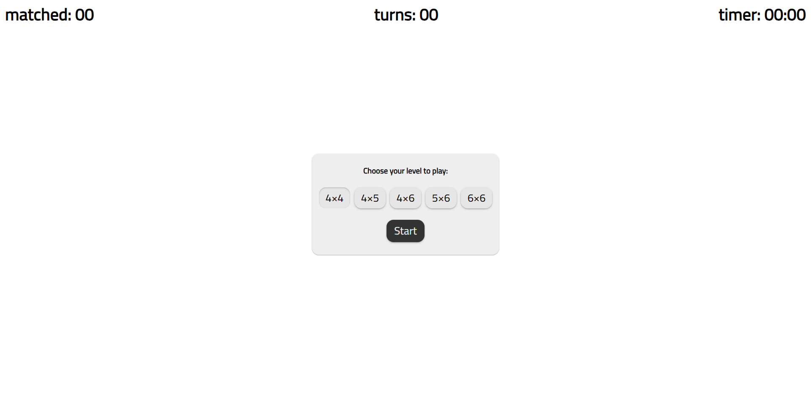
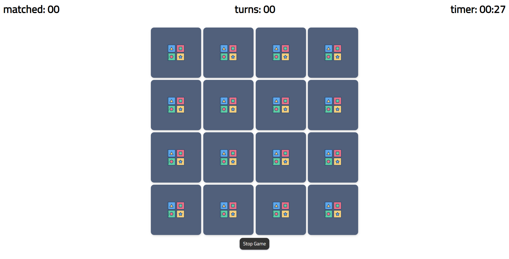
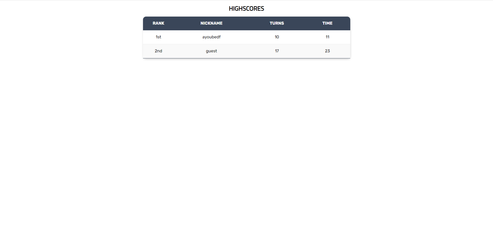

# card-memory-game

## Game Rules

The first player turns over 2 cards. If the pictures match, the player keeps the cards and tries again for another match. If they do not match the cards are turned over again and the player to the left takes a turn. Each player must try to remember where they have seen cards, so they can use them to make a match.
